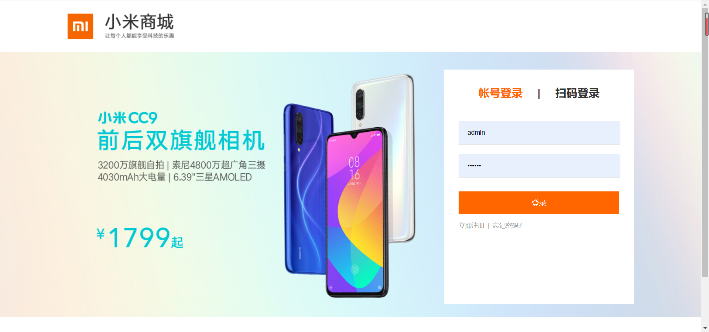

# 仿小米商城后端服务
## 介绍

模拟小米官网的后端服务


## 前端启动

项目地址https://gitee.com/gitxys/mi_vue

[代码地址Gitee](https://gitee.com/gitxys/mi_vue)

[代码地址GitHub](https://github.com/xuyisu/mi_vue)

控制台先安装依赖包

```
npm install 
```

然后运行下面代码即可启动

```
npm run serve
```

## 页面介绍

浏览器输入http://localhost:8080 将看到一下页面


登录:**用户名/密码**  admin/123456



购物车


订单确认


订单结算(彩蛋！！！！   这里的结算做了特殊处理)


订单列表


亲，留个star 吧
